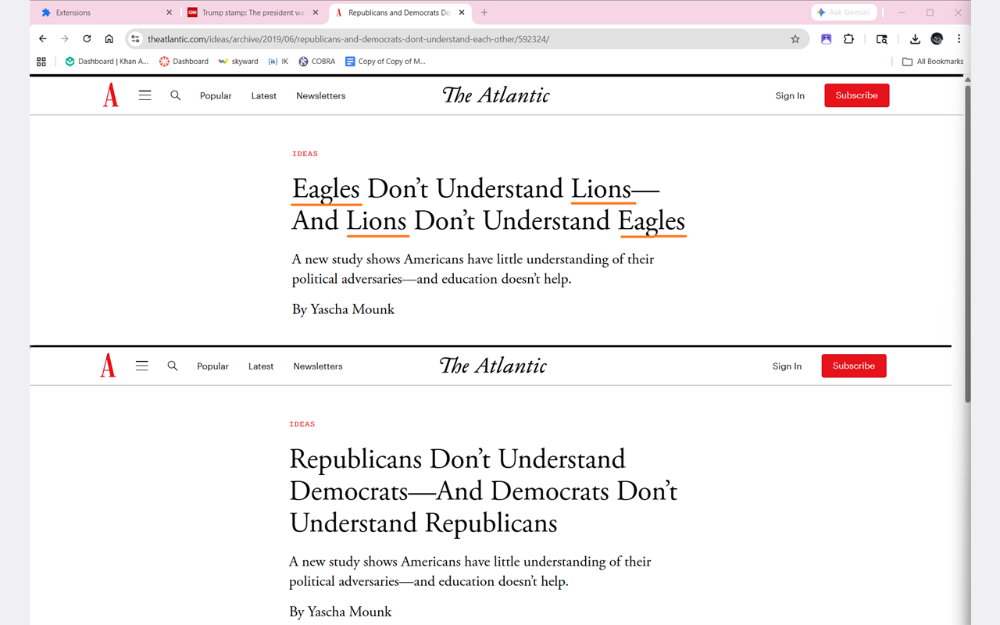

# Bias Buster

> Read the news without political identity bias.

A Chrome extension that obfuscates political party names, politicians, and organizations on news sites — replacing them with playful, themed pseudonyms (Fantasy, Sci-Fi, Food, Animals). Engage with the *ideas* in an article without the *identity* of who's saying them.



## Why

The same argument reads very differently depending on who's making it. Bias Buster strips out the identity cues (party, politician, faction names) so you can engage with the substance. It's reversible — hold the **Reveal** button to see the originals at any time.

## Install (unpacked)

1. Clone this repo
2. Open `chrome://extensions`
3. Enable **Developer mode** (top-right)
4. Click **Load unpacked** and select the project root
5. Visit any of the [103 supported news sites](manifest.json) — the icon lights up and the popup shows how many entities were obfuscated

No API key required for the default provider.

## Themes

| Theme | Example: Republicans → ? |
|-------|--------------------------|
| 🧛 Fantasy | Werewolves, Vampires, Wizards, Druids |
| 🚀 Sci-Fi | Empire, Federation, Rebels, Syndicate |
| 🍕 Food   | Tacos, Pizzas, Sushi, Burgers |
| 🦁 Animals | Eagles, Lions, Wolves, Bears |

Person pseudonyms are **deterministic** within a theme — the same person always becomes the same character (e.g. Joe Biden → "Lord Malachar" in Fantasy, every time).

## Privacy

The default **Local Database** provider runs entirely inside the extension — page text never leaves your device, no API keys, no network calls. It matches against a hand-curated list of ~100 political figures bundled with the extension.

If you opt into **OpenAI** or **Claude** providers via Settings, page text is sent to that provider's API (using your own API key, stored only in `chrome.storage.sync`). The extension's content script never sees the keys; all API calls go through the service worker.

## Architecture

Plain vanilla JS, Manifest V3, no build step. See [`engineerReadme.md`](engineerReadme.md) for a plain-English walkthrough of how the pieces fit together, and [`bias-buster-spec.md`](bias-buster-spec.md) for the original spec.

```
manifest.json                  MV3 — service worker + content scripts
background/service-worker.js   Routes extraction calls to active provider
content/content-script.js      DOM walk + text replacement + toggle
popup/                         Toggle, theme picker, hold-to-reveal, entity badge
options/                       Provider chooser, API keys, exclusion list
providers/
  gazetteer-provider.js        Local entity match (default, no API key)
  openai-provider.js           gpt-4o-mini
  claude-provider.js           Claude Haiku
  mock-provider.js             Hardcoded for dev
data/entities-db.json          The local gazetteer (~100 entities)
themes/themes.json             Faction names + person pseudonym lists
icons/                         16/32/48/128 PNG + master SVG + generator
screenshots/                   Web Store launch assets (1280×800)
```

## Adding entities

The local database is just a JSON file — drop a new entry into [`data/entities-db.json`](data/entities-db.json):

```json
{ "id": "person_yourname", "canonical": "Full Name", "aliases": ["Last Name", "Title Last Name"], "type": "person", "affiliations": ["party_dem"] }
```

Reload the extension — no build required.

## Adding sites

Add the match pattern in two places in `manifest.json`: `host_permissions` and `content_scripts[0].matches`. Reload at `chrome://extensions`. The popup auto-derives the supported-page list from the manifest, so no other code changes are needed.

## License

MIT — see `LICENSE` (or add one).
